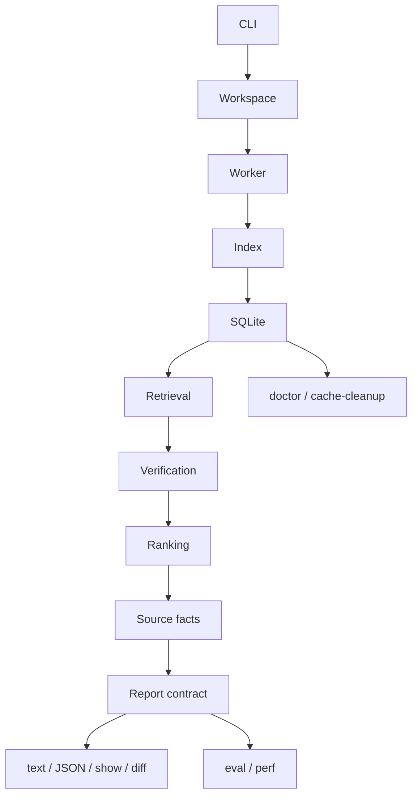

# End-to-End Architecture

The as-built reference for `lean-dup`. Rust owns workflow, persistence, scale, ranking, reporting, evaluation, and
release. Lean owns facts that require the elaborated environment. Everything else flows from that.

For the layering rule, see [00-overview.md](/Users/jcreinhold/Code/lean-dup/docs/architecture/00-overview.md). For
release status, see [04-production-readiness.md](/Users/jcreinhold/Code/lean-dup/docs/architecture/04-production-readiness.md).
For Rust crate boundaries, see [07-crate-factoring.md](/Users/jcreinhold/Code/lean-dup/docs/architecture/07-crate-factoring.md).

## Current status

Operational, Rust/Lean-only. Not release-ready.

Implemented:

- Python implementation removed (modules, tests, packaging).
- Source-backed/static provenance.
- Cache lifecycle diagnostics and protected cleanup.
- Additive report contract.

Open:

- KanProofs regression quality unproven; KanProofs/mathlib recall poor; hard-negative leakage remains.
- Useful proof-grade probe yield needs real-workload validation.
- Full mathlib comparison expensive even with warm caches.
- CI, packaging, version output, install docs, release reproducibility.

Search-quality is now governed by
[search-quality.md](/Users/jcreinhold/Code/lean-dup/docs/architecture/search-quality.md), which defines the match
classes, stage objectives, and evidence thresholds release hardening waits on.

No FFI spike is currently justified. Measured work points to import, index, retrieval, report shaping, and quality
issues, not subprocess framing.

## Commands

| Command | Purpose |
| --- | --- |
| `doctor` | inspect workspace, worker, Lake, and cache health |
| `index` | build or reuse a workspace index |
| `index-mathlib` | build or reuse the audited project's pinned mathlib index |
| `audit` | produce duplicate-review groups from local, imported, mathlib, or external evidence |
| `show` | explain one group resolvable from the current workspace/index context |
| `diff` | compare two saved audit baselines |
| `eval` | run fixture, hard-negative, KanProofs, or aggregate quality suites |
| *hidden* `perf` | run named performance workloads and write profiling artifacts |
| *hidden* `cache-cleanup` | inspect or remove unprotected stale cache entries |

The CLI is read-only with respect to audited Lean source. It may build Lean artifacts through Lake and write indexes,
reports, and diagnostics under the cache root or `target/`, but it does not edit the audited workspace.

## Pipeline

A normal audit: parse command, resolve workspace and modules, ensure a compatible worker, open or build the required
indexes, retrieve bounded candidates, optionally verify high-value pairs in Lean, rank and filter groups, attach
source-backed context, build stable explanation facts, render text or JSON. Eval and perf use the same lower layers
with different suite/workload ownership and artifact policy.

## Components

### CLI and commands

`crates/cli/src/cli.rs` defines the user and hidden developer command surface. `commands.rs` routes commands and
writes stdout/stderr or output files. It does not own Lake layout, worker transport, SQLite schema, audit phase
ordering, ranking policy, probe details, or text/JSON formatting. Hidden `perf` and `cache-cleanup` exist for
production engineering only.

### Workspace and mathlib resolution

`workspace.rs` owns Lake workspace discovery, module root resolution, and source-file enumeration. `mathlib.rs` owns
the project-pinned mathlib contract: `index-mathlib --workspace <project>` indexes the mathlib package under that
project's Lake dependency graph, not a global mathlib checkout. The boundary hides `.lake/packages`, source-root
attribution, module enumeration, and project execution root policy. The shared mathlib cache key excludes the audited
project's absolute path and includes the pinned mathlib content and relevant toolchain/worker semantics.

### Lean worker and protocol

The worker under `lean/LeanDup/` imports selected modules and emits typed semantic rows through the versioned protocol
in [01-worker-protocol.md](/Users/jcreinhold/Code/lean-dup/docs/architecture/01-worker-protocol.md). Six commands:
`extract`, `features`, `index`, `probe`, `doctor`, `version`. Rust may rely on declaration rows, feature rows, probe
results, progress, completion, and structured errors. Rust may not rely on Lean `Expr` constructors, pretty-printed
statement text, private worker batching, or stderr wording.

Worker construction has separate policies for small interactive operations and long index-building work. Large
index-worker timeout policy lives inside the worker/index boundary, so production-gate mathlib indexing completes
without user-facing timeout flags.

### Index store and cache lifecycle

`index.rs` persists local, external, and mathlib indexes in SQLite. Callers ask for capabilities—build or reuse an
index, query postings, hydrate declarations, read provenance—and do not inspect table names, row ids, insertion
phases, or transaction order.

`cache.rs` and `cache_lifecycle.rs` own cache roots, source-relevant fingerprints, latest-pointer interpretation,
diagnostics, disk usage, and protected cleanup. Default shared cache root: `~/.cache/lean-dup` (override with
`LEAN_DUP_CACHE_DIR`). Invalidation is based on inputs that affect semantic rows: Lean source, Lake files, toolchain,
worker/protocol/index semantic versions, include policies, selected roots, relevant dependency sources. It is not
based on unrelated non-Lean files or broad repository dirtiness.

`doctor --format json` is the user-facing diagnostic surface. Hidden `cache-cleanup` is dry-run by default and
protects active latest targets and expected current indexes before deletion.

### External provenance

`external_provenance.rs` owns the source-backed vs static distinction. See
[05-external-comparison-provenance.md](/Users/jcreinhold/Code/lean-dup/docs/architecture/05-external-comparison-provenance.md).
Ranking and semantic verification consume a typed policy object, not label strings. A static index named `mathlib`
remains usable but cannot silently claim proof-grade Lean evidence.

### Retrieval

`lean-dup-search` owns the full audit workflow through `audit::run_audit`. `retrieval.rs` turns indexed semantic keys
into bounded candidate pairs, combining exact, permutation, connective, conclusion, role-aware, and other indexed
postings without exposing key shape or posting tables upward. Retrieval controls candidate volume before ranking and
semantic verification.

Hot unordered paths use hash-based accumulators where deterministic ordering is not required. Stable output ordering
is applied at selected boundaries, not throughout every inner loop.

### Semantic verification

`semantic_verification.rs` owns probe planning, budgets, cache keys, source-backed module import planning, private and
generated declaration filters, unavailable classification, and diagnostics. The verifier receives hydrated facts and a
comparison evidence policy, then returns typed `SemanticEvidence`.

The default policy probes only obligations that can produce actionable proof-grade evidence. It does not run broad
semantic work over weak feature-only overlaps. Pair-local failures become typed unavailable evidence where possible:
missing declaration, unsupported, opaque or unreducible, timeout, or internal error. Batch-fatal worker failures are a
fallback path, not normal control flow.

Parallel Lean probe workers are not the default because each worker imports a large environment; measured work has so
far favored removing weak obligations and improving reuse before multiplying imports.

### Ranking and review profiles

`ranking.rs` consumes candidates, indexed facts, semantic evidence, provenance policy, source facts, and review-profile
settings. It produces ranked groups with signals, blockers, evidence mode, visibility, priority, and recommended
actions. It does not know SQLite tables or Lean worker messages.

Default output favors actionable findings. Feature-only and noisy groups are hidden unless the user asks for broader
profiles or `--show-noise`. Broad exploration remains available; the default queue is not a dump of every indexed
overlap.

### Source facts and replacement hints

`source_refs.rs` owns local source scans, imports, source fingerprints, and scoped caller-reference collection.
`replacement_hints.rs` owns whether a visible group can receive import/replacement guidance and what caller impact can
be shown.

Source-reference scanning is scoped to groups that can use the facts, instead of scanning every hidden/noise group.
The search audit workflow coordinates phases without exposing import parsing or caller-token policy to CLI callers.

### Report contract, rendering, show, diff

`lean-dup-report` builds stable explanation facts from the audit model before renderers format anything. See
[report-contract.md](/Users/jcreinhold/Code/lean-dup/docs/architecture/report-contract.md).

Audit JSON is additive and includes `report_schema_version` plus `explanations` for visible queues, hidden groups,
semantic probes, and comparison provenance. Text output explains empty queues directly. `show` explains one group in
terms of evidence mode, semantic evidence or blockers, visibility, and replacement/import/caller impact. Progress and
profile output remain stderr-only so JSON stdout stays parseable. `diff` compares saved baselines.

### Evaluation and performance

`eval.rs` owns suite definitions, label provenance, manual/private-path policy, audit observation, hard-negative gate
enforcement, and raw denominator metrics. The scorer is general: it scores unordered pairs and queue membership
without learning KanProofs paths or cache internals. Production-gate detail:
[evaluation/production-gates.md](/Users/jcreinhold/Code/lean-dup/docs/architecture/evaluation/production-gates.md).

`perf.rs` owns named workloads, cost-class extraction, and artifact naming. The hidden command makes performance
claims reproducible without exposing cache deletion, SQL probes, or shell timing sequences as public workflow.

## Workflow notes

- **`audit`** compares selected workspace declarations with local candidates, direct imports, explicit import roots, a
  project-pinned mathlib index, or named external indexes. With source-backed evidence, proof-grade visible claims
  require semantic verification. With static indexes, findings remain explicitly static.
- **`show`** explains a ranked group resolvable from the current workspace/index context. It is not yet a full
  report-file browser.
- **`eval --suite default` / `eval --suite hard-negatives`** are fast fixture gates. `kanproofs-internal` and
  `kanproofs-mathlib` are explicit manual suites. `production-gate` aggregates them and reports raw denominators.
- **`perf`** workloads measure realistic runtime and cost classes. Outputs land under `target/perf/`.

## Guardrails

The doctrine these guardrails come from lives in
[00-overview.md](/Users/jcreinhold/Code/lean-dup/docs/architecture/00-overview.md). The short form: do not move Lean
semantic interpretation into Rust through pretty-printed text; do not expose SQLite layout, cache-key JSON, or
latest-pointer details to audit/ranking/reporting; do not let a label such as `mathlib` imply proof-grade evidence
without provenance; do not make broad/noisy candidate dumps the default; do not put private KanProofs paths in default
CI; do not treat aggregate eval command completion as release quality when raw recall and hard-negative denominators
fail; do not preserve Python compatibility shells.
