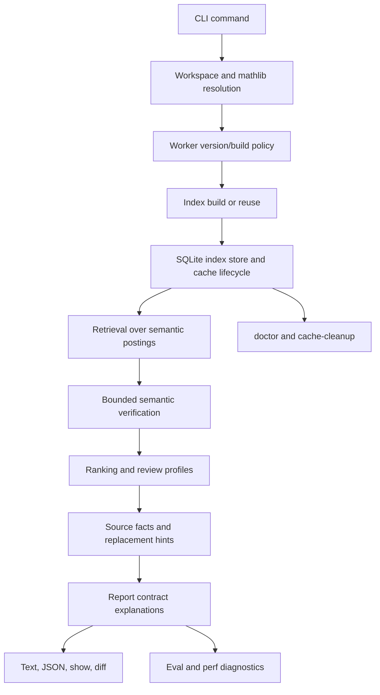

# End-to-End Architecture

This is the primary as-built architecture reference for `lean-dup`. The implementation is now a Rust/Lean-only local
auditor: Rust owns workflow, persistence, scale, ranking, reporting, evaluation, and release diagnostics; Lean owns
facts that require the elaborated Lean environment.

For historical context, see [00-overview.md](/Users/jcreinhold/Code/lean-dup/docs/architecture/00-overview.md). For
release status, see
[04-production-readiness.md](/Users/jcreinhold/Code/lean-dup/docs/architecture/04-production-readiness.md).

## Scope

This document owns the current end-to-end mental model: user workflows, internal boundaries, data flow, design
rationale, and known production blockers. It intentionally avoids SQLite table layouts, worker JSONL framing details,
Lean expression traversal algorithms, and probe chunking policy except where those details explain a boundary.

The public command surface is:

- `doctor`: inspect workspace, worker, Lake, and cache health.
- `index`: build or reuse a workspace index.
- `index-mathlib`: build or reuse the audited project's pinned mathlib index.
- `audit`: produce duplicate-review groups from local, imported, mathlib, or external comparison evidence.
- `show`: explain one group that can be resolved from the current workspace/index context.
- `diff`: compare two saved audit baselines.
- `eval`: run fixture, hard-negative, KanProofs, or aggregate quality suites.
- hidden `perf`: run named performance workloads and write profiling artifacts.
- hidden `cache-cleanup`: inspect or remove unprotected stale cache entries.

The CLI remains read-only with respect to audited Lean source. It may build Lean artifacts through Lake and write
indexes, reports, and diagnostics under the cache root or `target/`, but it does not edit the audited workspace.

## System Thesis

The core rule is still the Lean/Rust boundary:

- Lean owns semantic facts and bounded semantic probes.
- Rust owns scale, persistence, orchestration, retrieval, ranking, reporting, and validation.

This division keeps each layer deep. Lean hides elaborated expression structure, binder handling, canonicalization, and
definitional-equality checks. Rust hides SQLite, cache lifecycle, suite policy, progress rendering, report contracts,
and performance artifacts. JSON and JSONL are transport encodings, not semantic architecture.

## Pipeline

The normal audit path starts with command parsing, resolves the Lake workspace and selected modules, ensures a compatible
Lean worker, opens or builds the required indexes, retrieves bounded candidates, optionally verifies high-value pairs in
Lean, ranks and filters groups, attaches source-backed context, builds stable explanation facts, and renders text or
JSON. Evaluation and performance tooling use the same lower layers; they differ only in suite/workload ownership and
artifact policy.

## Components

### CLI And Commands

`crates/lean-dup-rs/src/cli.rs` defines the user and hidden developer command surface. `commands.rs` orchestrates
workflows but does not own Lake layout, worker transport, SQLite schema, ranking policy, probe details, or text/JSON
formatting. That keeps command handling from becoming a temporal script in Rust.

The public UX is deliberately small: users ask to inspect, index, audit, show, diff, or evaluate. Hidden commands exist
only for production engineering: `perf` for named workload artifacts and `cache-cleanup` for protected cache lifecycle
maintenance.

### Workspace And Mathlib Resolution

`workspace.rs` owns Lake workspace discovery, module root resolution, and source-file enumeration. `mathlib.rs` owns the
project-pinned mathlib contract: `index-mathlib --workspace <project>` indexes the mathlib package under that project's
Lake dependency graph, not a global mathlib checkout used as the audited workspace.

This boundary hides `.lake/packages`, source-root attribution, module enumeration, and project execution root policy.
The shared mathlib cache key excludes the audited project's absolute path and includes the pinned mathlib content and
the relevant toolchain/worker semantics.

### Lean Worker And Protocol

The Lean worker lives under `lean/LeanDup/`. It imports selected modules and emits typed semantic rows through the
versioned protocol documented in
[01-worker-protocol.md](/Users/jcreinhold/Code/lean-dup/docs/architecture/01-worker-protocol.md).

The worker supports `extract`, `features`, `index`, `probe`, `doctor`, and `version`. Rust may rely on declaration rows,
feature rows, probe results, progress, completion, and structured errors. Rust must not rely on Lean `Expr` constructors,
pretty-printed statement text, private worker batching details, or stderr wording.

Worker construction has separate policies for small interactive operations and long index-building work. Prompt 27 moved
large index-worker timeout policy into the worker/index boundary so production-gate mathlib indexing can complete
without adding user-facing timeout flags.

### Index Store And Cache Lifecycle

`index.rs` persists local, external, and mathlib indexes in SQLite. Callers ask for capabilities: build or reuse an
index, query postings, hydrate declarations, or read provenance. They do not inspect table names, row IDs, insertion
phases, or transaction order.

`cache.rs` and `cache_lifecycle.rs` own cache roots, source-relevant fingerprints, latest-pointer interpretation,
diagnostics, disk usage, and protected cleanup. The default shared cache root is `~/.cache/lean-dup`, overrideable by
environment. Index invalidation is based on inputs that affect semantic rows: Lean source, Lake files, toolchain,
worker/protocol/index semantic versions, include policies, selected roots, and relevant dependency sources. It is not
based on unrelated non-Lean files or broad repository dirtiness.

`doctor --format json` is the user-facing diagnostic surface for cache health. Hidden `cache-cleanup` is dry-run by
default and protects active latest targets and expected current indexes before deletion.

### External Provenance

`external_provenance.rs` owns the distinction between static and source-backed comparison evidence, documented in
[05-external-comparison-provenance.md](/Users/jcreinhold/Code/lean-dup/docs/architecture/05-external-comparison-provenance.md).

`--compare-mathlib` is source-backed and project-centered by construction. `--compare-index <label>` may be:

- `proof-grade`: source-backed and importable in the current audit Lake environment;
- `source-backed-not-importable`: source-backed but not importable from the current execution root;
- `static`: old, minimal, or intentionally static index metadata.

Ranking and semantic verification consume a policy object, not label strings. A static index named `mathlib` remains
usable, but it cannot silently claim proof-grade Lean evidence.

### Retrieval

`retrieval.rs` turns indexed semantic keys into bounded candidate pairs. It combines exact, permutation, connective,
conclusion, role-aware, and other indexed postings without exposing key shape or posting tables upward. Retrieval is
where candidate volume is controlled before ranking and semantic verification.

Hot unordered paths use hash-based accumulators where deterministic ordering is not required. Stable output ordering is
applied at selected boundaries, not throughout every inner loop.

### Semantic Verification

`semantic_verification.rs` owns probe planning, budgets, cache keys, source-backed module import planning, private and
generated declaration filters, unavailable classification, and diagnostics. The verifier receives hydrated facts and a
comparison evidence policy, then returns typed `SemanticEvidence`.

The default policy probes only obligations that can produce actionable proof-grade evidence. It does not run broad
semantic work over weak feature-only overlaps. Pair-local failures become typed unavailable evidence where possible:
missing declaration, unsupported, opaque or unreducible, timeout, or internal error. Batch-fatal worker failures are a
fallback path, not normal control flow.

This design is intentionally bounded. Parallel Lean probe workers are not the default because each worker imports a
large environment; measured work has so far favored removing weak obligations and improving reuse before multiplying
imports.

### Ranking And Review Profiles

`ranking.rs` consumes candidates, indexed facts, semantic evidence, provenance policy, source facts, and review profile
settings. It produces ranked groups with signals, blockers, evidence mode, visibility, priority, and recommended
actions. It does not know SQLite tables or Lean worker messages.

Default output favors actionable findings. Feature-only and noisy groups are hidden unless the user asks for broader
profiles or `--show-noise`. This is a production UX choice: broad exploration remains available, but the default queue
is not a dump of every indexed overlap.

### Source Facts And Replacement Hints

`source_refs.rs` owns local source scans, imports, source fingerprints, and scoped caller-reference collection.
`replacement_hints.rs` owns whether a visible group can receive import/replacement guidance and what caller impact can
be shown.

Prompt 25 made this boundary important for throughput: source-reference scanning is scoped to groups that can use the
facts, rather than scanning every hidden/noise group. Audit coordinates the phases but does not know import parsing or
caller-token policy.

### Report Contract, Rendering, Show, And Diff

`report_contract.rs` builds stable explanation facts from the audit model before renderers format anything. The contract
is documented in [report-contract.md](/Users/jcreinhold/Code/lean-dup/docs/architecture/report-contract.md).

Audit JSON is additive and includes `report_schema_version` plus `explanations` for visible queues, hidden groups,
semantic probes, and comparison provenance. Text output explains empty queues directly. `show` explains one group in
terms of evidence mode, semantic evidence or blockers, visibility, and replacement/import/caller impact. Progress and
profile output remain stderr-only so JSON stdout stays parseable.

`diff` compares saved baselines. It operates on report artifacts and remains a review workflow, not a source rewrite
tool.

### Evaluation And Performance

`eval.rs` owns suite definitions, label provenance, manual/private-path policy, audit observation, hard-negative gate
enforcement, and raw denominator metrics. The scorer remains general: it scores unordered pairs and queue membership
without learning KanProofs paths or cache internals. Production-gate details are documented in
[evaluation/production-gates.md](/Users/jcreinhold/Code/lean-dup/docs/architecture/evaluation/production-gates.md).

`perf.rs` owns named workloads, cost-class extraction, and artifact naming. The hidden command makes performance claims
reproducible without exposing cache deletion, SQL probes, or shell timing sequences as public workflow.

## Workflow Semantics

### `doctor`

`doctor` resolves the workspace, checks Lake/Lean/worker availability, and reports cache lifecycle diagnostics. In JSON
mode it is the release diagnostic surface for cache root, labels, active latest targets, schema status, provenance,
declaration counts when readable, and disk usage.

### `index`

`index` builds or reuses a source-backed workspace index for selected modules. The index records source provenance and
semantic versions. Old or missing provenance remains readable as static evidence rather than forcing a migration.

### `index-mathlib`

`index-mathlib` builds or reuses the audited project's pinned mathlib index. It runs in the local project Lake
environment and attributes declarations to the pinned mathlib source root. The cache is content-addressed for reuse
across projects pinned to the same relevant mathlib/toolchain/worker semantics.

### `audit`

`audit` compares selected workspace declarations with local candidates, direct imports, explicit import roots, a
project-pinned mathlib index, or named external indexes. With source-backed comparison evidence, proof-grade visible
claims require semantic verification. With static indexes, findings remain explicitly static.

### `show`

`show` explains a ranked group that can be resolved from the current workspace/index context. It is not yet a full
report-file browser. Prompt 29 may decide whether real workload review needs report-file-backed `show`.

### `eval`

`eval --suite default` and `eval --suite hard-negatives` are fast fixture gates. `kanproofs-internal` and
`kanproofs-mathlib` are explicit manual suites. `production-gate` aggregates them and reports raw denominators.

The current production-gate command completes, but quality is not production-ready: the Prompt 27 artifact reports
aggregate recall@10 `15/32`, aggregate hard-negative hits `3/16`, KanProofs/mathlib recall@10 `0/11`, and
KanProofs/mathlib hard-negative hits `3/4`.

### `perf`

Hidden `perf` workloads measure realistic runtime and cost classes. Reports under
`docs/architecture/performance/` preserve historical measurements; current notes identify where later prompts supersede
old failures.

## Current Production Status

The implementation is operational and Rust/Lean-only. It is not production-ready.

Closed or implemented gates:

- Python implementation deprecation is complete; Python code, tests, and packaging are removed.
- Source-backed/static provenance is implemented.
- Cache lifecycle diagnostics and protected cleanup are implemented.
- The report contract is implemented additively.

Open quality/release blockers:

- KanProofs regression quality is not proven.
- KanProofs/mathlib recall is currently poor in the production-gate artifact.
- KanProofs/mathlib hard-negative leakage remains.
- Semantic probes are safer and more recoverable, but useful proof-grade yield still needs real-workload validation.
- Full mathlib comparison remains expensive even with warm caches.
- CI, packaging, version output, install docs, and release reproducibility are still prompt 28 work.

No FFI spike is currently justified. The measured work so far points to import/index/retrieval/report shaping and
quality issues, not subprocess framing as the dominant release blocker.

## Design Guardrails

- Do not move Lean semantic interpretation into Rust through pretty-printed text.
- Do not expose SQLite layout, cache-key JSON, or latest-pointer details to audit/ranking/reporting callers.
- Do not make labels such as `mathlib` imply proof-grade evidence without provenance.
- Do not make broad/noisy candidate dumps the default report.
- Do not make private KanProofs paths part of default CI.
- Do not treat aggregate eval command completion as release quality when raw recall and hard-negative denominators fail.
- Do not preserve Python compatibility shells; preserve validated capabilities through Rust/Lean code and fixture labels.
